# 字典

* [相关位置文件](#相关位置文件)
* [演变和实现](#演变和实现)
* [内存构造](#演变和实现)
  * [combined table 和 split table](#combined-table-和-split-table)
  * [indices 和 entries](#indices-和-entries)
* [哈希碰撞与删除](#哈希碰撞与删除)
* [表扩展](#表扩展)
* [indices数组](#indices数组)
* [缓冲池](#缓冲池)
* [删除操作](#删除操作)
  * [为什么标记成 DKIX_DUMMY](#为什么标记成-DKIX_DUMMY)
  * [entries 中的删除](#entries-中的删除)
* [结束](#结束)

* [更多资料](#更多资料)

# 相关位置文件

* cpython/Objects/dictobject.c
* cpython/Objects/clinic/dictobject.c.h
* cpython/Include/dictobject.h
* cpython/Include/cpython/dictobject.h


# 演变和实现

在深入看 CPython 字典对象的内部构造和实现之前，我们先来想象一下，如果让我们自己造一个字典对象会长成什么样呢？

通常情况下，我们会用哈希表来实现一个字典对象，平均情况下你只需要花费 O(1) 的时间复杂度即可以完成对一个元素的查找，这也是 CPython 的实现方式

下图是在 [python3.6](https://github.com/python/cpython/commit/742da040db28e1284615e88874d5c952da80344e ) 版本之前，一个指向 python 内部字典对象的入口指针

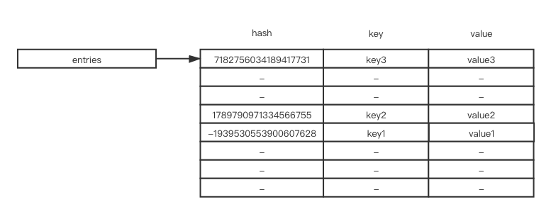

如果你的应用场景下有比较多的字典对象, 当它们以稀疏的哈希表存储时，会浪费较多的内存空间，为了用更紧凑的方式来实现哈希表，可以把 哈希索引 和 真正的键值对分开存放，下图是 python3.6 版本以后的实现方式

下图是 python3.6 版本以后的实现方式

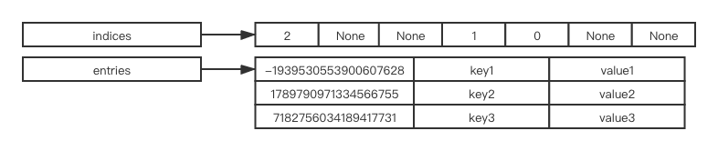

`indices` 指向了一列索引, `entries` 指向了原本的存储哈希表内容的结构

你可以把 `indices` 理解成新的简化版的哈希表, `entries` 理解成一个数组, 数组中的每个元素是原本应该存储的哈希结果,键和值

查找或者插入一个元素的时候, 根据键的哈希值结果取模 `indices` 的长度, 就能得到对应的数组下标, 再根据对应的数组下标到 `entries` 中获取到对应的结果, 比如 `hash("key2") % 8` 的结果是 `3`, 那么 `indices[3]` 的值是 `1`, 这时候到 `entries` 中找到对应的 `entries[1]` 既为所求的结果

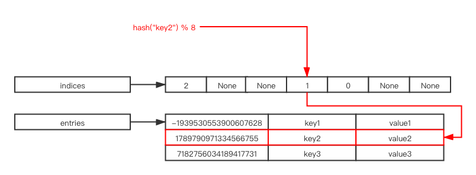

这么做的好处是空间利用率得到了较大的提升, 我们以 64 位操作系统为例, 每个指针的长度为 8 字节, 则原本需要 `8 * 3 * 8` 为 `192`

现在变成了 `8 * 3 * 3 + 1 * 8` 为 `80`, 节省了 58% 左右的内存空间

并且由于 `entries` 是按照插入顺序进行插入的数组, 对字典进行遍历时能按照插入顺序进行遍历, 而在旧的哈希表方案中, 由于不同键的哈希值不一样, 哈希表中的顺序是按照哈希值大小排序的, 遍历时从前往后遍历表现起来就是 "无序" 的, 这也是为什么 python3.6 以前的版本字典对象是 **无序** 的但是 python3.6 以后的版本字典对象是 **有序** 的原因

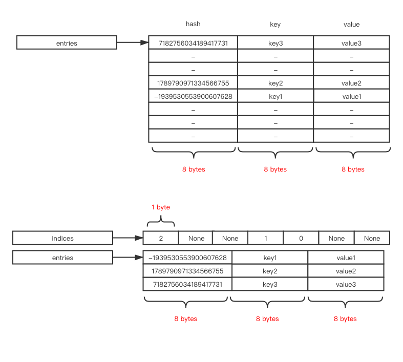

这个方案最初是由 [PyPy](https://morepypy.blogspot.com/2015/01/faster-more-memory-efficient-and-more.html) 提出, 并在 [pep 468](https://www.python.org/dev/peps/pep-0468/]) 中引入到了 CPython, 在 python3.6 版本进行了实现

# 内存构造

我们来看看 **PyDictObject** 的内存构造

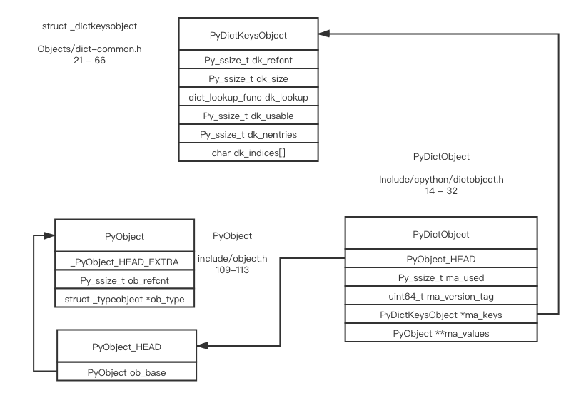

## combined table 和 split table

第一次看到 **PyDictObject** 的定义是很疑惑的，**ma_values** 是什么? 怎么 **PyDictKeysObject** 和上面看到的 indices/entries 结构长得不太一样 ?

下面是经过翻译的源代码注释

```c
/*
字典对象可以按照以下两种方式来表示
The DictObject can be in one of two forms.

Either:
  要么是一张 combined table
  A combined table:
    此时 ma_values 为 NULL, dk_refcnt 为 1
    ma_values == NULL, dk_refcnt == 1.
    哈希表的值都存储在 PyDictKeysObject 所包含的 me_value 这个字段里，也就是上图的方式存储
    Values are stored in the me_value field of the PyDictKeysObject.
Or:
  要么是一张 split table
  A split table:
    此时 ma_values 不为空，并且 dk_refcnt 的值 大于等于 1
    ma_values != NULL, dk_refcnt >= 1
    哈希表的值都存储在 PyDictObject 里面的 ma_values 这个数组里
    Values are stored in the ma_values array.
    只能存储 unicode 对象
    Only string (unicode) keys are allowed.
    所有共享的 哈希键值 必须是按照同样顺序插入的
    All dicts sharing same key must have same insertion order.
*/
```

什么意思呢? 在什么情况下字段对象会共享同样的键，但是不共享值呢? 而且键还只能是 unicode 对象，字典对象中的键还不能被删除? 我们来试试看

```python3
# 我更改了部分源代码，解释器执行 split table 查询时会打印出一些信息

class B(object):
	b = 1

b1 = B()
b2 = B()

# __dict__ 对象还未生成
>>> b1.b
1
>>> b2.b
1

# __dict__ 对象已经生成(通过 descriptor protocol), b1.__dict__ 和 b2.__dict__ 都是 split table, 他们共享一份 PyDictKeysObject
>>> b1.b = 3
in lookdict_split, address of PyDictObject: 0x10bc0eb40, address of PyDictKeysObject: 0x10bd8cca8, key_str: b
>>> b2.b = 4
in lookdict_split, address of PyDictObject: 0x10bdbbc00, address of PyDictKeysObject: 0x10bd8cca8, key_str: b
>>> b1.b
in lookdict_split, address of PyDictObject: 0x10bc0eb40, address of PyDictKeysObject: 0x10bd8cca8, key_str: b
3
>>> b2.b
in lookdict_split, address of PyDictObject: 0x10bdbbc00, address of PyDictKeysObject: 0x10bd8cca8, key_str: b
4
# 进行删除操作之后，b2.__dict__ 会从 split table 变为 combined table
>>> b2.x = 3
in lookdict_split, address of PyDictObject: 0x10bdbbc00, address of PyDictKeysObject: 0x10bd8cca8, key_str: x
>>> del b2.x
in lookdict_split, address of PyDictObject: 0x10bdbbc00, address of PyDictKeysObject: 0x10bd8cca8, key_str: x
# 现在，看不到 lookdict_split 的输出了，说明已经变成了 combined table
>>> b2.b
4
```

`split table` 可以在你对同个`class` 有非常多实例的时候节省很多内存，这些实例在满足上述条件时，都会共享同一个 `PyDictKeysObject`, 更多关于实现方面的细节请参考 [PEP 412 -- Key-Sharing Dictionary](https://www.python.org/dev/peps/pep-0412/)

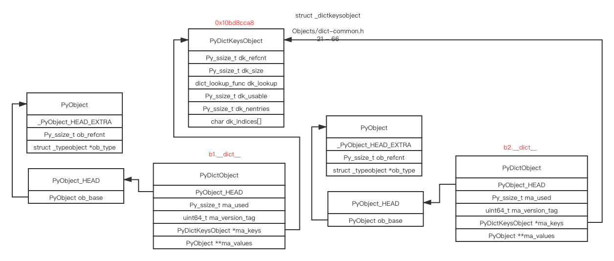

## indices 和 entries

我们进到源代码里看一下 CPython 如何在 **PyDictKeysObject** 中实现 indices/entries, **char dk_indices[]** 又是什么意思?

```c
/*
这是代码本身的注释，我进行了翻译
dk_indices 是真正的哈希表，他在 entries 存储了哈希的索引，或者 DKIX_EMPTY(-1) 和 DKIX_DUMMY(-2) 的一种
dk_size 字段表示 indices 的大小，但是这个字段的类型是可以根据表的大小变化的

* int8  for          dk_size <= 128
* int16 for 256   <= dk_size <= 2**15
* int32 for 2**16 <= dk_size <= 2**31
* int64 for 2**32 <= dk_size

dk_entries 是一个数组，里面的对象类型是 PyDictKeyEntry, 他的大小可以用 USABLE_FRACTION 这个宏来表示， DK_ENTRIES(dk) 可以获得真正哈希键对值的第一个入口

# 注意, DKIX_EMPTY 和 DKIX_DUMMY 是用负数表示的，所有 dk_indices 里面的索引类型也需要用有符号整数表示，int16 用来表示 dk_size 为 256 的表
*/

#define DK_SIZE(dk) ((dk)->dk_size)
#if SIZEOF_VOID_P > 4
#define DK_IXSIZE(dk)                          \
    (DK_SIZE(dk) <= 0xff ?                     \
        1 : DK_SIZE(dk) <= 0xffff ?            \
            2 : DK_SIZE(dk) <= 0xffffffff ?    \
                4 : sizeof(int64_t))
#else
#define DK_IXSIZE(dk)                          \
    (DK_SIZE(dk) <= 0xff ?                     \
        1 : DK_SIZE(dk) <= 0xffff ?            \
            2 : sizeof(int32_t))
#endif
#define DK_ENTRIES(dk) \
    ((PyDictKeyEntry*)(&((int8_t*)((dk)->dk_indices))[DK_SIZE(dk) * DK_IXSIZE(dk)]))

```

这个宏一开始看的时候不是很好理解，我们把他重写一下

```c
#define DK_ENTRIES(dk) \
    ((PyDictKeyEntry*)(&((int8_t*)((dk)->dk_indices))[DK_SIZE(dk) * DK_IXSIZE(dk)]))

```

重写成

```python3
// 假设 indices array 里的类型为 int8_t
size_t indices_offset = DK_SIZE(dk) * DK_IXSIZE(dk);
int8_t *pointer_to_indices = (int8_t *)(dk->dk_indices);
int8_t *pointer_to_entries = pointer_to_indices + indices_offset;
PyDictKeyEntry *entries = (PyDictKeyEntry *) pointer_to_entries;

```

现在就比较清晰

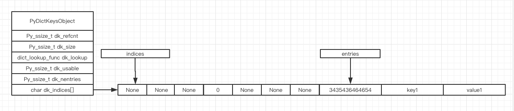

`indices` 和 `entries` 是一段连续的连起来的空间, `indices` 指向前面介绍的哈希索引, `entries` 指向真正存储数据的数组头部

# 哈希碰撞与删除

CPython 是怎么处理字典对象里的哈希碰撞的呢? 除了依靠一个好的哈希函数，cpython 还实现了一个 perturb 策略
我们可以截取部分源代码注释看下

```python3
j = ((5*j) + 1) mod 2**i
0 -> 1 -> 6 -> 7 -> 4 -> 5 -> 2 -> 3 -> 0 [开始下次循环]
perturb >>= PERTURB_SHIFT;
j = (5*j) + 1 + perturb;
use j % 2**i as the next table index;
```

我更改了部分源代使得每次打印出更多信息, 更改后的代码可在参考资料中找到

```python3
>>> d = dict()
>>> d[1] = "value1"
>>> repr(d)
ma_used: 1, ma_version_tag: 16667, PyDictKeyObject.dk_refcnt: 1, PyDictKeyObject.dk_size: 8, PyDictKeyObject.dk_usable: 4, PyDictKeyObject.dk_nentries: 1
index: 0 ix: -1 DKIX_EMPTY
index: 1 ix: 0 me_hash: 1, me_key: 1, me_value: 'value1'
index: 2 ix: -1 DKIX_EMPTY
index: 3 ix: -1 DKIX_EMPTY
index: 4 ix: -1 DKIX_EMPTY
index: 5 ix: -1 DKIX_EMPTY
index: 6 ix: -1 DKIX_EMPTY
index: 7 ix: -1 DKIX_EMPTY
"{1: 'value1'}"
```

这里 `indices` 是索引, 索引里面 **-1(DKIX_EMPTY)** 表示这个位置是空的, 现在代码里设置了 `d[1] = "value1"`, 而`hash(1) & mask == 1`, 会对应到 indices 的下标为 1 的位置上, 这个位置原本是 `-1(DKIX_EMPTY)`, 表示没有被占用过, 马上占用他, 把这里的 `-1` 改成 entries 里面第一个空余的真正的存储 key 和 value 的位置, 这个位置是 0, 所以就把 0 存储到了 `indices[1]` 里

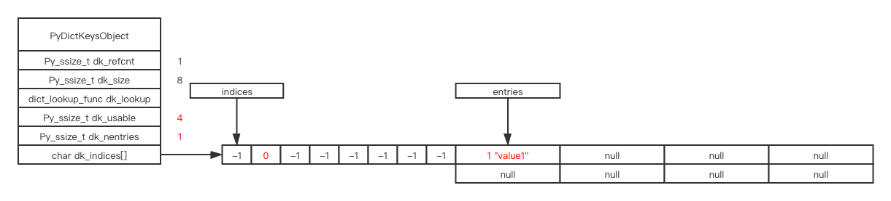

```python3
d[4] = "value4"
```

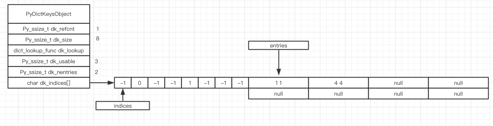

每新增一个元素, `dk_usable` 就减小1, `dk_nentries` 就增加1

```python3 
d[7] = "value7"
```

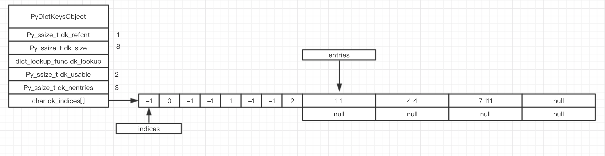

```python3
# 在删除的时候并不会把索引清除，而是把对应那格的索引标记成 DKIX_DUMMY, DKIX_DUMMY 数字表示为 -2
# 并且 dk_usable 和 dk_nentries 并没有改变
del d[4]
```

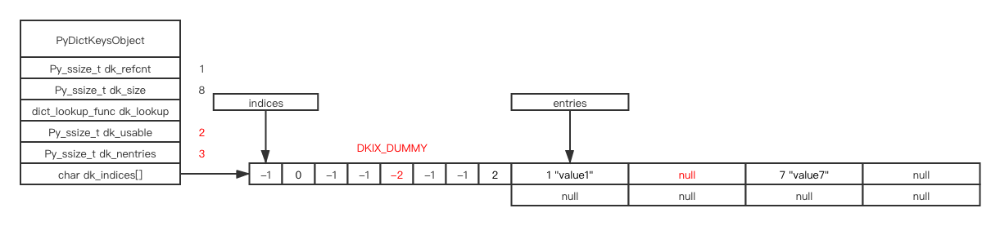

```python3
# 注意, dk_usable 和 dk_nentries 现在变了
d[0] = "value0"
```

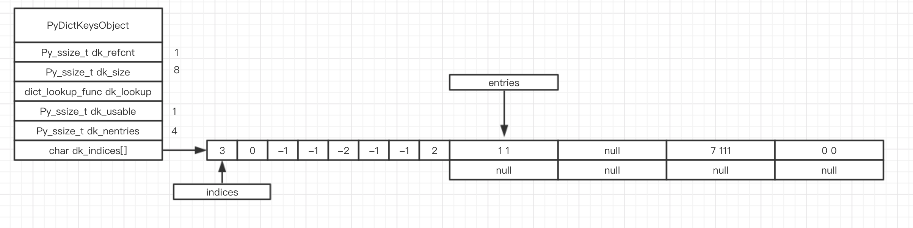

我们此时插入一个哈希结果为 16 的键的话, `hash (16) & mask == 0`, 而 `0` 已经被占用, 就产生了哈希碰撞, 在一些常规的哈希表的实现中, 比如 `Redis` 的 `hashtable` 使用的是开链法, CPython 的 `set` 对象使用的是线性探测法, 而CPython 的 `dict` 对象中为了避免上述两种方法的缺点, 实现了一套更加分散的探测方法(篇幅限制就不展开细说了, 有兴趣的同学可以参考源码注释) 

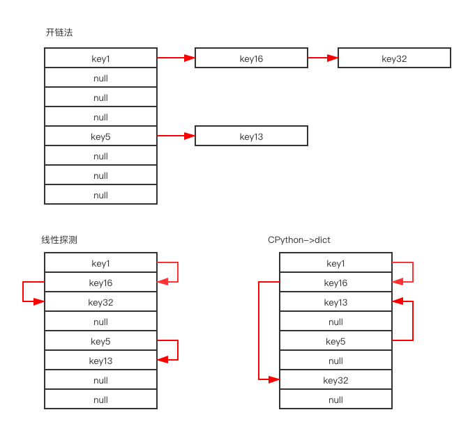

我们现在插入 `d[16] = "value16"` 看看结果

```python3
d[16] = "value16"
# hash (16) & mask == 0
# 但是索引位置 0 已经被 key: 0, value: 0 这个对象占用了
# 当前 perturb = 16, PERTURB_SHIFT = 5, i = 0
# 所以, perturb >>= PERTURB_SHIFT ===> perturb == 0
# i = (i*5 + perturb + 1) & mask ===> i = 1
# 现在, 索引位置 1 依然被 key: 1, value: 1 占用
# 当前 perturb = 0, PERTURB_SHIFT = 5, i = 1
# 所以, perturb >>= PERTURB_SHIFT ===> perturb == 0
# i = (i*5 + perturb + 1) & mask ===> i = 6
# 此时索引位置 6 是空的，插入
```

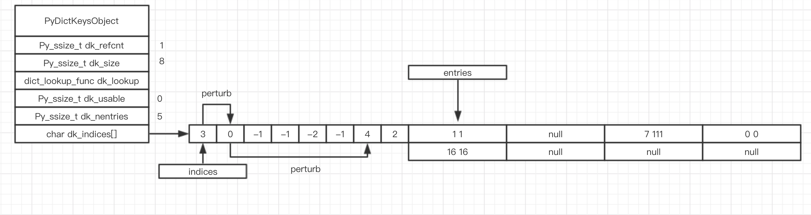

# 表扩展

现在, `dk_usable` 为 0, `dk_nentries` 为 5, 说明当前表中存储的元素已经达到了阈值, 再插入一组对象试试

```python3
d[5] = "value5"
```

第一步，表达到了阈值，扩展表，并复制

索引里被标记成 `DKIX_DUMMY` 不会被复制，所以索引对应的位置后面的元素都会往前移

第二步， 插入 

```python3
key: 5, value: "value5"
```

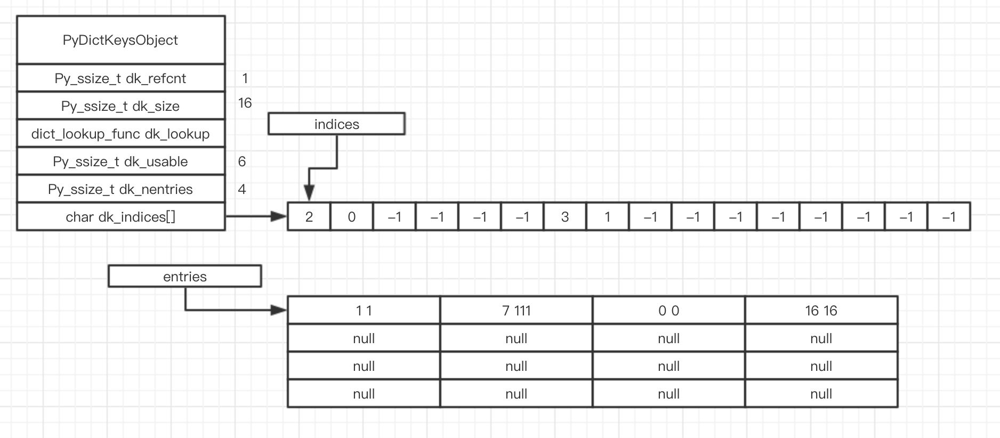

# indices数组

indices 数组的大小是可变的，当你的哈希表大小 <= 128 时，索引数组的元素类型为 int_8, 表变大时会相应地用 int16, int32 或者 int64 来表示，这样做可以节省内存使用，这个策略在上面代码注释部分解释过了

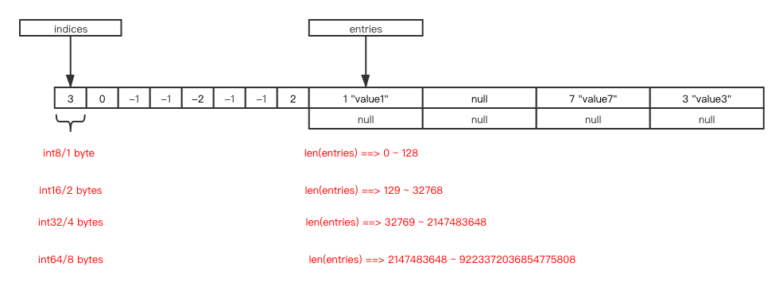

# 缓冲池

```python3
#ifndef PyDict_MAXFREELIST
#define PyDict_MAXFREELIST 80
#endif
static PyDictObject *free_list[PyDict_MAXFREELIST];
```

CPython 同时使用了 free_list 来重新循环使用那些被删除掉的字典对象，这样做的好处是可以避免内存碎片并且提高性能

每个进程都拥有一个全局变量 `free_list`

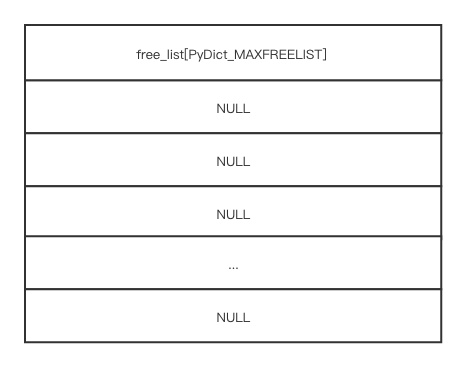

如果我们创建一个新的 `dict` 对象, 创建新对象的内存分配过程会用到 CPython 的 [内存管理机制](https://github.com/zpoint/CPython-Internals/blob/master/Interpreter/memory_management/memory_management_cn.md)

```python3
d = dict()
```

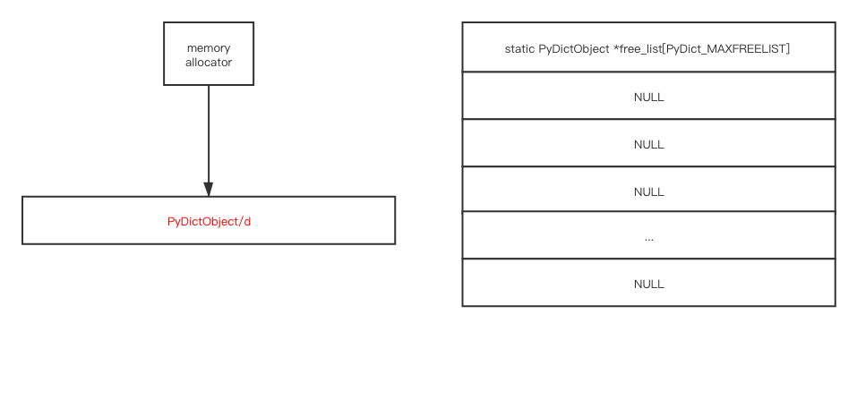

之后我们再删除这个字典对象

```python3
del a
```

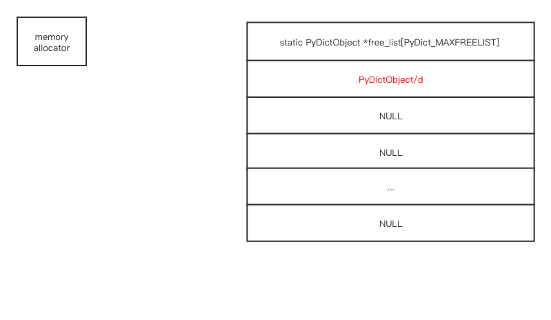下一次你创建一个新的 `dict` 对象时, 会优先检查 `free_list` 中是否有可用的对象, 如果有的话则从 `free_list` 取, 如果没有的话, 再从 CPython 的 [内存管理机制](https://github.com/zpoint/CPython-Internals/blob/master/Interpreter/memory_management/memory_management_cn.md) 申请

```python3
d = dict()
```

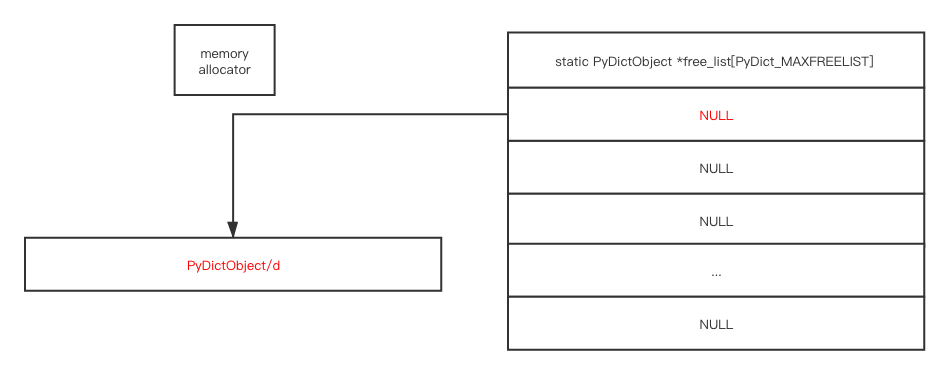

# 删除操作

字典中元素的删除使用的是 [惰性删除](https://en.wikipedia.org/wiki/Lazy_deletion) 的策略(前面已展示过)

## 为什么标记成 DKIX_DUMMY

indices 总共只有三种不同状态的值, **DKIX_EMPTY**(-1), **DKIX_DUMMY**(-2) 和 **Active/Pending**(>=0). 如果你把删除的对象标记为 **DKIX_EMPTY** 而不是 **DKIX_DUMMY**, **perturb** 策略在插入/搜索这个对象的时候将会出现问题

假设你有一个大小为 8 的哈希表, 他的 indices 如下所示

```python3
indices: [0]  [1] [DKIX_EMPTY] [2] [DKIX_EMPTY] [DKIX_EMPTY]   [3]  [4]
index:    0    1         2      3        4           5          6    7

```

当你搜索一个哈希值为 0 的对象, 并且这个对象的位置在 entries[4] 时, "perturb" 的搜索过程如下

```python3
0 -> 1 -> 6 -> 7(找到匹配的值, 不需要往下搜索了)

```

假设你删除掉 indices[6] 上面的对象, 并把他标记为 **DKIX_EMPTY**, 当你再次搜索同一个对象的时候

```python3
indices: [0]  [1] [DKIX_EMPTY] [2] [DKIX_EMPTY] [DKIX_EMPTY]   [DKIX_EMPTY]  [4]
index:    0    1         2      3        4           5               6        7

```

搜索过程如下所示

```python3
0 -> 1 -> 6(这个位置上的值为 DKIX_EMPTY, 最后一个哈希值相同的对象插入的时候只会插入到上一个perturb的位置, 也就是 indices[1], 如果搜索到第一个 DKIX_EMPTY 还没有发现匹配的值, 说明搜索的这个值不在这张表里)

```

实际上需要搜索的对象在 indices[7] 上面, 但是由于错误的标记了 **DKIX_EMPTY**, 搜索停留在了 indices[6] 上, 如果我们把他标记成正确的值 **DKIX_DUMMY**

```python3
indices: [0]  [1] [DKIX_EMPTY] [2] [DKIX_EMPTY] [DKIX_EMPTY]   [DKIX_DUMMY]  [4]
index:    0    1         2      3        4           5               6        7

```

搜索过程会变成

```python3
0 -> 1 -> 6(DKIX_DUMMY, 说明这个坑位之前被插入过, 但已经被删除, 也许后面还有同样的哈希值的对象, 继续往下搜索) -> 7(找到匹配的值, 不需要往下搜索了)

```

当然, 标记为 **DKIX_DUMMY** 的坑位也可以用来插入新的对象

## entries 中的删除

删除操作不对 **entries** 中的元素进行重新排序, 这么做可以保证字典中的元素存储顺序是按照 [插入顺序](https://mail.python.org/pipermail/python-dev/2017-December/151283.html) 来进行保存的

并且把 `entries[i]` 当成空的值, 在后续表扩展/压缩时再重新压缩这部分空余的空间, 可以保持删除操作的平均时间复杂度为 O(1), 这在算法中是一种平摊(amortized)的思想

并且通常情况下字典对象的删除操作并不普遍, 只有部分情况下会导致性能变慢

# 结束

看似简单的字典对象, 实际上底层实现起来包括了不少的计算机体系的知识, 看似复杂, 但其实大部分都是我们熟悉的算法和数据结构

# 更多资料

* [pypy-blog](https://morepypy.blogspot.com/2015/01/faster-more-memory-efficient-and-more.html)

* [python-dev](https://mail.python.org/pipermail/python-dev/2012-December/123028.html)