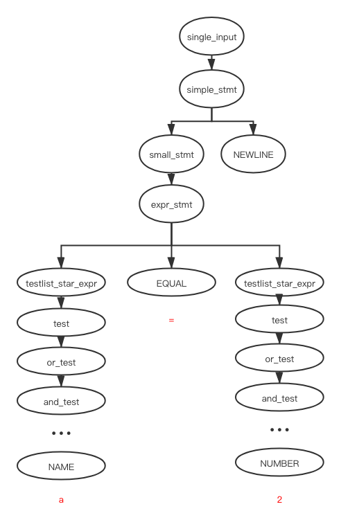
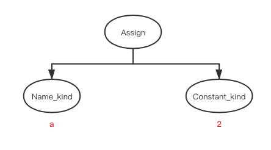

# CST TO AST

# contents

* [related file](#related-file)
* [pythonrun](#pythonrun)
* [CST TO AST](#CST-TO-AST)
* [read more](#read-more)

# related file

* Python/ast.c

* Python/pythonrun.c

* Include/Python-ast.h

* Python/Python-ast.c

* Python/asdl.c

* Include/asdl.h

  

The following command will generate `Include/Python-ast.h` and `Python/Python-ast.c` from `Parser/Python.asdl`, which will be used to construct `AST` from the previos [parse tree](https://github.com/zpoint/CPython-Internals/blob/master/Interpreter/compile/compile.md#parse)

```shell
% make regen-ast
# Regenerate Include/Python-ast.h using Parser/asdl_c.py -h
./install-sh -c -d ./Include
python3 ./Parser/asdl_c.py \
                -h ./Include/Python-ast.h.new \
                ./Parser/Python.asdl
python3 ./Tools/scripts/update_file.py ./Include/Python-ast.h ./Include/Python-ast.h.new
# Regenerate Python/Python-ast.c using Parser/asdl_c.py -c
./install-sh -c -d ./Python
python3 ./Parser/asdl_c.py \
                -c ./Python/Python-ast.c.new \
                ./Parser/Python.asdl
python3 ./Tools/scripts/update_file.py ./Python/Python-ast.c ./Python/Python-ast.c.new

```

> * Lowercase names are non-terminals.
> * Uppercase names are terminals.
> * Literal tokens are in double quotes.
> * `[]` means zero or one.
> * `{}` means one or more.
> * `?` means it is optional, `*` means 0 or more

# pythonrun

We  take the interactive loop as example, the call stack of `pythonrun`


# CST TO AST

Let's focus on `PyAST_FromNodeObject`

If we execute 

```python3
a = 2
```

This is the CST of above expression

```shell
n_type: 256, n_type_str: single_input, n_str: (null), n_children: 1
  n_type: 270, n_type_str: simple_stmt, n_str: (null), n_children: 2
    n_type: 271, n_type_str: small_stmt, n_str: (null), n_children: 1
      n_type: 272, n_type_str: expr_stmt, n_str: (null), n_children: 3
        n_type: 274, n_type_str: testlist_star_expr, n_str: (null), n_children: 1
          n_type: 305, n_type_str: test, n_str: (null), n_children: 1
            n_type: 309, n_type_str: or_test, n_str: (null), n_children: 1
              n_type: 310, n_type_str: and_test, n_str: (null), n_children: 1
                n_type: 311, n_type_str: not_test, n_str: (null), n_children: 1
                  n_type: 312, n_type_str: comparison, n_str: (null), n_children: 1
                    n_type: 315, n_type_str: expr, n_str: (null), n_children: 1
                      n_type: 316, n_type_str: xor_expr, n_str: (null), n_children: 1
                        n_type: 317, n_type_str: and_expr, n_str: (null), n_children: 1
                          n_type: 318, n_type_str: shift_expr, n_str: (null), n_children: 1
                            n_type: 319, n_type_str: arith_expr, n_str: (null), n_children: 1
                              n_type: 320, n_type_str: term, n_str: (null), n_children: 1
                                n_type: 321, n_type_str: factor, n_str: (null), n_children: 1
                                  n_type: 322, n_type_str: power, n_str: (null), n_children: 1
                                    n_type: 323, n_type_str: atom_expr, n_str: (null), n_children: 1
                                      n_type: 324, n_type_str: atom, n_str: (null), n_children: 1
                                        n_type: 1, n_type_str: NAME, n_str: a, n_children: 0
        n_type: 22, n_type_str: EQUAL, n_str: =, n_children: 0
        n_type: 274, n_type_str: testlist_star_expr, n_str: (null), n_children: 1
          n_type: 305, n_type_str: test, n_str: (null), n_children: 1
            n_type: 309, n_type_str: or_test, n_str: (null), n_children: 1
              n_type: 310, n_type_str: and_test, n_str: (null), n_children: 1
                n_type: 311, n_type_str: not_test, n_str: (null), n_children: 1
                  n_type: 312, n_type_str: comparison, n_str: (null), n_children: 1
                    n_type: 315, n_type_str: expr, n_str: (null), n_children: 1
                      n_type: 316, n_type_str: xor_expr, n_str: (null), n_children: 1
                        n_type: 317, n_type_str: and_expr, n_str: (null), n_children: 1
                          n_type: 318, n_type_str: shift_expr, n_str: (null), n_children: 1
                            n_type: 319, n_type_str: arith_expr, n_str: (null), n_children: 1
                              n_type: 320, n_type_str: term, n_str: (null), n_children: 1
                                n_type: 321, n_type_str: factor, n_str: (null), n_children: 1
                                  n_type: 322, n_type_str: power, n_str: (null), n_children: 1
                                    n_type: 323, n_type_str: atom_expr, n_str: (null), n_children: 1
                                      n_type: 324, n_type_str: atom, n_str: (null), n_children: 1
                                        n_type: 2, n_type_str: NUMBER, n_str: 2, n_children: 0
    n_type: 4, n_type_str: NEWLINE, n_str: , n_children: 0
```

In diagram representation, you can check the `Grammar/Grammar` file



The CST to AST part is written in `Python/ast.c`, The function inside the file is a hand writting parsing according to gramma file, while the return type `expr_ty` is the above auto generated c structure

```c
// in Python/ast.c
static expr_ty
ast_for_atom(struct compiling *c, const node *n)
{
    /* atom: '(' [yield_expr|testlist_comp] ')' | '[' [testlist_comp] ']'
       | '{' [dictmaker|testlist_comp] '}' | NAME | NUMBER | STRING+
       | '...' | 'None' | 'True' | 'False'
    */
    node *ch = CHILD(n, 0);

    switch (TYPE(ch)) {
    case NAME: {
        PyObject *name;
        const char *s = STR(ch);
        size_t len = strlen(s);
        if (len >= 4 && len <= 5) {
            if (!strcmp(s, "None"))
                return Constant(Py_None, LINENO(n), n->n_col_offset, c->c_arena);
            if (!strcmp(s, "True"))
                return Constant(Py_True, LINENO(n), n->n_col_offset, c->c_arena);
            if (!strcmp(s, "False"))
                return Constant(Py_False, LINENO(n), n->n_col_offset, c->c_arena);
        }
        name = new_identifier(s, c);
        if (!name)
            return NULL;
        /* All names start in Load context, but may later be changed. */
        return Name(name, Load, LINENO(n), n->n_col_offset, c->c_arena);
    }
    // ...
    case NUMBER: {
        PyObject *pynum = parsenumber(c, STR(ch));
        if (!pynum)
            return NULL;

        if (PyArena_AddPyObject(c->c_arena, pynum) < 0) {
            Py_DECREF(pynum);
            return NULL;
        }
        return Constant(pynum, LINENO(n), n->n_col_offset, c->c_arena);
    }
    // ...
    default:
        PyErr_Format(PyExc_SystemError, "unhandled atom %d", TYPE(ch));
        return NULL;
    }
}
```

`Name` and `Load` are defined in `Python/Python-ast.c`

```c
// Python/Python-ast.c
expr_ty
Name(identifier id, expr_context_ty ctx, int lineno, int col_offset, PyArena
     *arena)
{
    expr_ty p;
    /* ... */
    p->kind = Name_kind;
    p->v.Name.id = id;
    p->v.Name.ctx = ctx;
    p->lineno = lineno;
    p->col_offset = col_offset;
    return p;
}

// Include/Python-ast.h
typedef enum _expr_context { Load=1, Store=2, Del=3, AugLoad=4, AugStore=5,
                             Param=6 } expr_context_ty;
// ...
typedef struct _expr *expr_ty;
```

`_Py_asdl_seq_new` is defined in `Python/asdl.c` and `asdl_seq_SET` is defined in `Include/asdl.h`

```c
// Python/ast.c
ast_for_global_stmt(struct compiling *c, const node *n)
{
    /* global_stmt: 'global' NAME (',' NAME)* */
    identifier name;
    asdl_seq *s;
    int i;

    REQ(n, global_stmt);
    s = _Py_asdl_seq_new(NCH(n) / 2, c->c_arena);
    if (!s)
        return NULL;
    for (i = 1; i < NCH(n); i += 2) {
        name = NEW_IDENTIFIER(CHILD(n, i));
        if (!name)
            return NULL;
        asdl_seq_SET(s, i / 2, name);
    }
    return Global(s, LINENO(n), n->n_col_offset, c->c_arena);
}

// Include/asdl.h
typedef struct {
    Py_ssize_t size;
    void *elements[1];
} asdl_seq;
// ...
#define asdl_seq_SET(S, I, V) (S)->elements[I] = (V)
```

This is the AST after conversion



The following [function](https://github.com/zpoint/CPython-Internals/blob/master/Interpreter/compile2/inspect_ast.c) can be used to inspect the above AST sctucture

# read more

* [using-asdl-to-describe-asts-in-compilers](https://eli.thegreenplace.net/2014/06/04/using-asdl-to-describe-asts-in-compilers)
* [What is Zephyr ASDL](https://www.oilshell.org/blog/2016/12/11.html)
* [Python's compiler - from CST to AST](https://aoik.me/blog/posts/python-compiler-from-cst-to-ast)
* [Design of CPython’s Compiler](https://devguide.python.org/compiler/)

