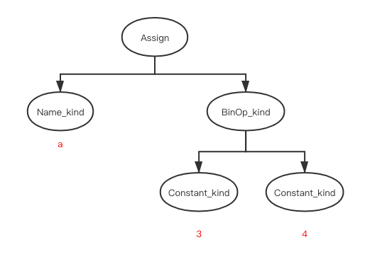
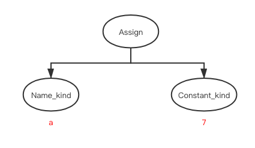
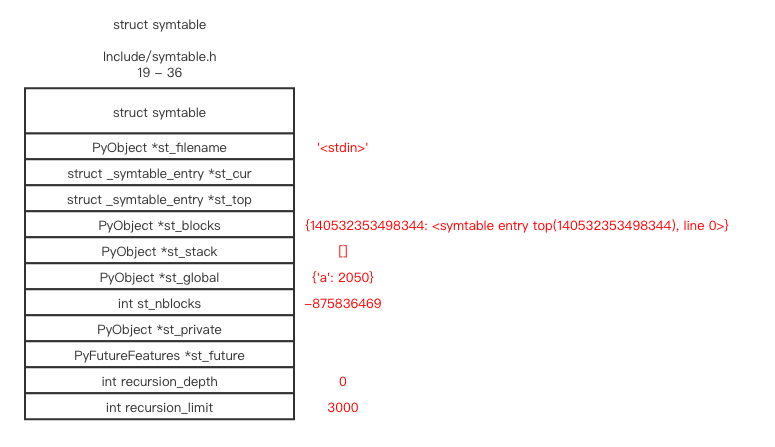

# AST 到 byte code

# 目录

* [related file](#related-file)
* [optimize](#optimize)
* [symtable](#symtable)
* [CodeObject](#CodeObject)
* [read more](#read-more)

# 相关位置文件

* Python/compile.c

* Python/pythonrun.c

* Python/symtable.c

* Include/symtable.h

* Python/ast_opt.c

  

我们来尝试从之前的  [语法树](https://github.com/zpoint/CPython-Internals/blob/master/Interpreter/compile2/compile_cn.md) 中生成对应的字节码

前面提到过的 `pythonrun` 的调用栈如下


这次关注的是 `PyAST_CompileObject` 这个函数

```c
PyCodeObject *
PyAST_CompileObject(mod_ty mod, PyObject *filename, PyCompilerFlags *flags,
                   int optimize, PyArena *arena)
{
    struct compiler c;
    PyCodeObject *co = NULL;
    PyCompilerFlags local_flags;
    int merged;
		// ... 忽略 ...

    if (!_PyAST_Optimize(mod, arena, c.c_optimize)) {
        goto finally;
    }

    c.c_st = PySymtable_BuildObject(mod, filename, c.c_future);
    if (c.c_st == NULL) {
        if (!PyErr_Occurred())
            PyErr_SetString(PyExc_SystemError, "no symtable");
        goto finally;
    }

    co = compiler_mod(&c, mod);

 finally:
    compiler_free(&c);
    assert(co || PyErr_Occurred());
    return co;
}
```

# optimize

`_PyAST_Optimize` 会针对AST做一些优化, 比如常量折叠

```c
static int
fold_binop(expr_ty node, PyArena *arena, int optimize)
{
    expr_ty lhs, rhs;
    lhs = node->v.BinOp.left;
    rhs = node->v.BinOp.right;
    if (lhs->kind != Constant_kind || rhs->kind != Constant_kind) {
        return 1;
    }

    PyObject *lv = lhs->v.Constant.value;
    PyObject *rv = rhs->v.Constant.value;
    PyObject *newval;

    switch (node->v.BinOp.op) {
    case Add:
        newval = PyNumber_Add(lv, rv);
        break;
    case Sub:
        newval = PyNumber_Subtract(lv, rv);
        break;
    case Mult:
        newval = safe_multiply(lv, rv);
        break;
    case Div:
        newval = PyNumber_TrueDivide(lv, rv);
        break;
    case FloorDiv:
        newval = PyNumber_FloorDivide(lv, rv);
        break;
    case Mod:
        newval = safe_mod(lv, rv);
        break;
    case Pow:
        newval = safe_power(lv, rv);
        break;
    case LShift:
        newval = safe_lshift(lv, rv);
        break;
    case RShift:
        newval = PyNumber_Rshift(lv, rv);
        break;
    case BitOr:
        newval = PyNumber_Or(lv, rv);
        break;
    case BitXor:
        newval = PyNumber_Xor(lv, rv);
        break;
    case BitAnd:
        newval = PyNumber_And(lv, rv);
        break;
    default: // Unknown operator
        return 1;
    }
    return make_const(node, newval, arena);
}
```

比如

```python3
a = 3 + 4
```

AST 表示如下



在 `fold_binop` 之后, 变成了



这个常量折叠的方法同样会做如下操作

* 展开二元操作(如上图)

* 展开一元操作(`not/is/isnot`)

* 把你的手写 list 转换成 tuple
* 展开常量可迭代对象的常量下标 `[]` 
* 等待 ...

# symtable

在 `_PyAST_Optimize` 之后,  `PySymtable_BuildObject` 会遍历 AST 并把 function/class/name 等定义/声明的变量加到一个 Python 字典对象中



#CodeObject

`compiler_mod`  会遍历这个 AST, 并且生成对应的指令集和所需要的数据, 之后生成对应的 `PyCodeObject` 对象

```c
static int
compiler_visit_expr1(struct compiler *c, expr_ty e)
{
  		// ...
      case Constant_kind:
        ADDOP_LOAD_CONST(c, e->v.Constant.value);
        break;
  		// ...
}

static int
compiler_addop_load_const(struct compiler *c, PyObject *o)
{
  	// 把对应的常量加到字典对象 c->u->u_consts 中, 并把对应常量的最后的位移位置返回
    Py_ssize_t arg = compiler_add_const(c, o);
    if (arg < 0)
        return 0;
  	// 把 `LOAD_CONST arg` 加到下一个指令中
    return compiler_addop_i(c, LOAD_CONST, arg);
}

// 下列的函数在 Python/compile.c 中可以找到
static int
compiler_addop_i(struct compiler *c, int opcode, Py_ssize_t oparg)
{
    struct instr *i;
    int off;

  	// ...
  
    off = compiler_next_instr(c, c->u->u_curblock);
    if (off < 0)
        return 0;
    i = &c->u->u_curblock->b_instr[off];
    i->i_opcode = opcode;
    i->i_oparg = Py_SAFE_DOWNCAST(oparg, Py_ssize_t, int);
    compiler_set_lineno(c, off);
    return 1;
}

static Py_ssize_t
compiler_add_const(struct compiler *c, PyObject *o)
{
    PyObject *key = merge_consts_recursive(c, o);
    if (key == NULL) {
        return -1;
    }

    Py_ssize_t arg = compiler_add_o(c, c->u->u_consts, key);
    Py_DECREF(key);
    return arg;
}

static Py_ssize_t
compiler_add_o(struct compiler *c, PyObject *dict, PyObject *o)
{
    PyObject *v;
    Py_ssize_t arg;

    v = PyDict_GetItemWithError(dict, o);
    if (!v) {
        if (PyErr_Occurred()) {
            return -1;
        }
        arg = PyDict_GET_SIZE(dict);
        v = PyLong_FromSsize_t(arg);
        if (!v) {
            return -1;
        }
        if (PyDict_SetItem(dict, o, v) < 0) {
            Py_DECREF(v);
            return -1;
        }
        Py_DECREF(v);
    }
    else
        arg = PyLong_AsLong(v);
    return arg;
}
```

常量在上述操作时是以字典形式存储的,  `{'a': 0}` 键表示对应常量的 `PyObject`, 值表示参数位移

它最终会被 `Python/compile.c->consts_dict_keys_inorder` 这个函数按照值里的位移顺序被转换成对应的列表对象, 

最终, `Python/compile.c->makecode` 会把上述的指令和对应的数据结构存储到新建的 `PyCodeObject ` 上

```shell
  1           0 LOAD_CONST               0 (7)
              2 STORE_NAME               0 (a)
              4 LOAD_CONST               1 (None)
              6 RETURN_VALUE
```

# read more

* [Python's compiler - from AST to code object](https://aoik.me/blog/posts/python-compiler-from-ast-to-code-object)

