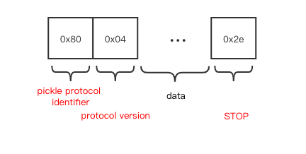
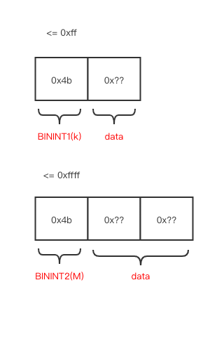
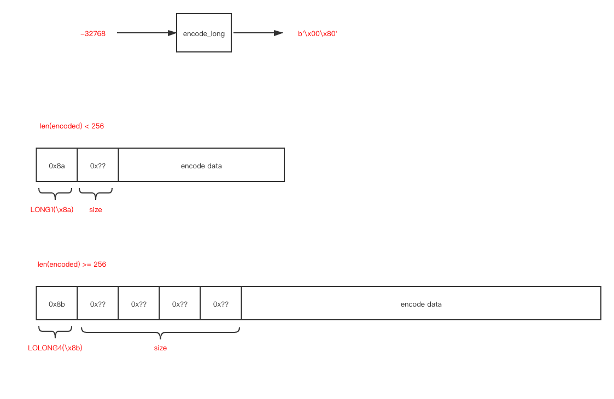
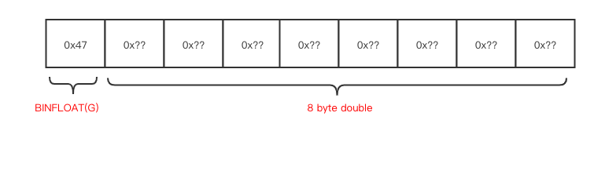
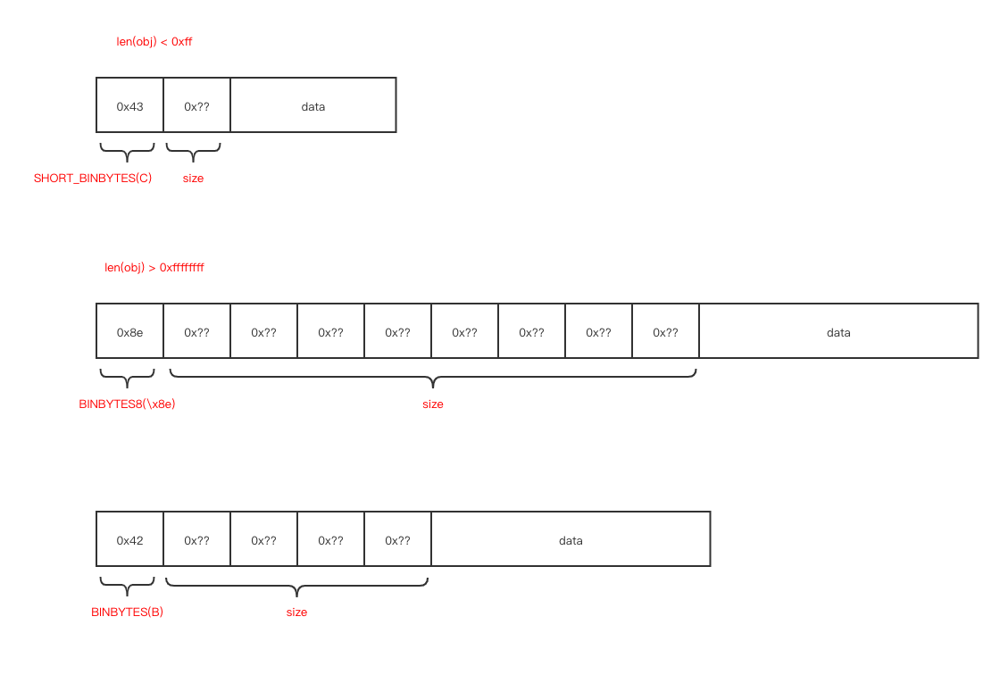
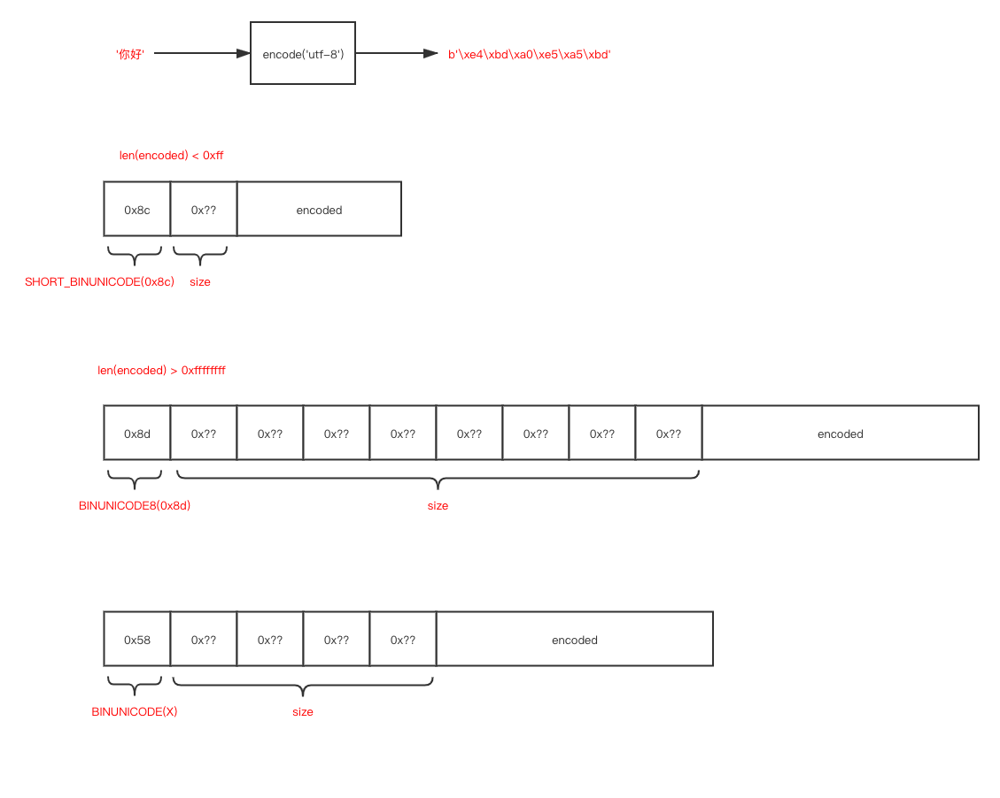
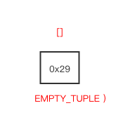
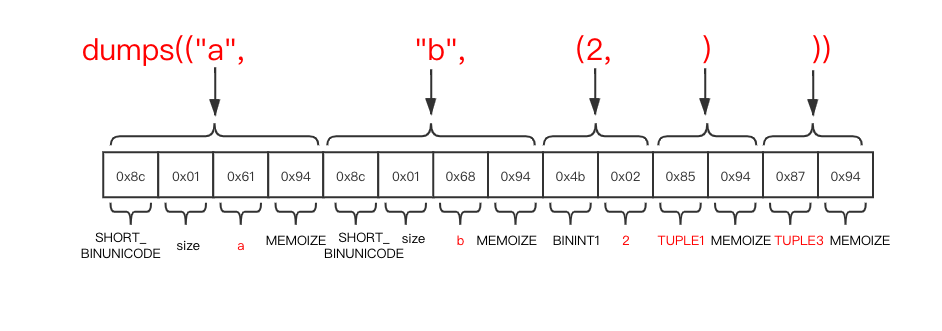

# Pickle

# contents

* [related file](#related-file)
* [introduction](#introduction)
* [implementation](#implementation)
  * [None](#None)
  * [bool](#bool)
  * [int](#int)
  * [float](#float)
  * [bytes](#bytes)
  * [str](#str)
  * [tuple](#tuple)
  * [list](#list)
  * [type](#type)
* [read more](#read-more)

# related file

* Lib/pickle.py
* Modules/_pickle.c
* Modules/clinic/_pickle.c.h

# introduction

The `pickle` module will use the faster  `_pickle` implemented in `C`(`Modules/_pickle.c`)  if possible, if the `_pickle` module not found, the `python` implemented `pickle`(`Lib/pickle.py`) will be used

|     Type     | Implementation |
| :----------: | :------------: |
|     None     |   save_none    |
|     bool     |   save_bool    |
|     int      |   save_long    |
|    float     |   save_float   |
|    bytes     |   save_bytes   |
|     str      |    save_str    |
|    tuple     |   save_tuple   |
|     list     |   save_list    |
|     dict     |   save_dict    |
|     set      |    save_set    |
|  frozenset   | save_frozenset |
| FunctionType |  save_global   |
|              |  save_reduce   |

# implementation

Whenever you call dump, some extra information will be added to the result

The first byte is an identifier indicate that the following binary content is encoded in "pickle protocol"

The second byte is the protocol version

The final byte is a stop symbol indicate that it's the end of the binary content




## None

```python3
NONE = b'N'   # push None

def save_none(self, obj):
	self.write(NONE)
```

The `data` is `N` here, with the aforementioned information added to it

```python3
>>> import pickle
>>> pickle.dumps(None)
b'\x80\x04N.'
```

## bool

`bool` is simiiar to `None`

```python3
NEWTRUE        = b'\x88'  # push True
NEWFALSE       = b'\x89'  # push False

def save_bool(self, obj):
	if self.proto >= 2:
		self.write(NEWTRUE if obj else NEWFALSE)
```

The `data` here is `b'\x88'(True)` and `b'\x89'(False)`

```python3
>>> import pickle
>>> pickle.dumps(True)
b'\x80\x04\x88.'
>>> pickle.dumps(False)
b'\x80\x04\x89.'
```

## int

The integer will be saved in various format according to it's value






## float

The float is saved in [IEEE_754](https://en.wikipedia.org/wiki/IEEE_754-1985) standard



## bytes

``bytes` object is save directly as the `data` part below

The `head` part various according to the data size



## str

`str` is similar to [bytes](#bytes),  except that `str` is encoded in `utf-8` format before dump



## tuple

`tuple` is more complicated than other basic type

If the `tuple` is empty



Let's see an example

```python3
dumps(("a", "b", (2, )))
b'\x80\x04\x95\x0f\x00\x00\x00\x00\x00\x00\x00\x8c\x01a\x94\x8c\x01b\x94K\x02\x85\x94\x87\x94.'
```

`\x80\x04` is pickle protocol and pickle version

`\x95\x0f\x00\x00\x00\x00\x00\x00\x00` is frame symbol(`\x95`) and frame size(8 bytes) in little endian

`.` in last byte is the `STOP` symbol

Besides are the data

 

I find that dumps does not support self reference tuples(how to [Build Self-Referencing Tuples](https://stackoverflow.com/questions/11873448/building-self-referencing-tuples))

## list

Let's see an exmple again

```python3
dumps(["a", "b", (2, )])
b'\x80\x04\x95\x11\x00\x00\x00\x00\x00\x00\x00]\x94(\x8c\x01a\x94\x8c\x01b\x94K\x02\x85\x94e.'
```

The first several bytes are pickle protocol, pickle version and frame size

The last byte is `STOP` symbol

The data can be described as (`]\x94(\x8c\x01a\x94\x8c\x01b\x94K\x02\x85\x94e`)

List will be dumped batch by batch(default batch size `1000`)


`dict` and `set` are similar to `list` and `tuple`, begin and end with `type` symbol inidicate the type, and iter through each object and recursive call `dump` for each object

## type

If what's to be saved is a type

```python3
class A(object):
    a = "a"
    b = "b"

    def run(self):
        print(self.a, self.b)

pickle.dumps(A)
b'\x80\x04\x95\x12\x00\x00\x00\x00\x00\x00\x00\x8c\x08__main__\x94\x8c\x01A\x94\x93\x94.'
```

  The data part is `\x8c\x08__main__\x94\x8c\x01A\x94\x93\x94`


# read more

