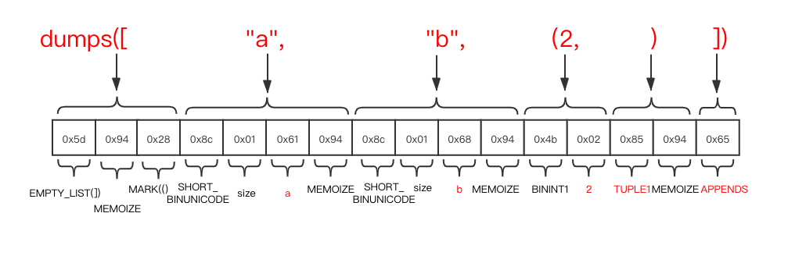
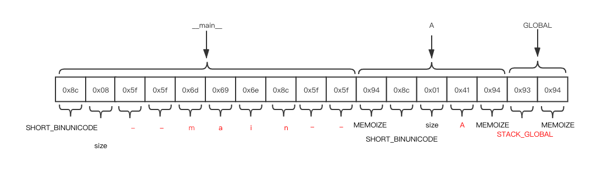
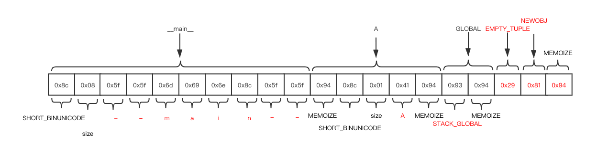

# pickle

# 目录

* [相关位置文件](#相关位置文件)
* [简介](#简介)
* [实现](#实现)
  * [None](#None)
  * [bool](#bool)
  * [int](#int)
  * [float](#float)
  * [bytes](#bytes)
  * [str](#str)
  * [tuple](#tuple)
  * [list](#list)
  * [type](#type)
  * [object](#object)

# 相关位置文件

* Lib/pickle.py
* Modules/_pickle.c
* Modules/clinic/_pickle.c.h

# 简介

我们用 `pickle` 来对 `python ` 中的对象进行序列化和反序列化, `pickle` 总共有好几个版本, 当前的版本号是 4

 `pickle` 模块会在可能的情况运行 `C(Modules/_pickle.c)` 实现的代码, 这样效率更高, 但是如果无法加载, 还有一个纯 `python` 实现的 `pickle`(`Lib/pickle.py`) 作为备选

|     类型     |      实现      |
| :----------: | :------------: |
|     None     |   save_none    |
|     bool     |   save_bool    |
|     int      |   save_long    |
|    float     |   save_float   |
|    bytes     |   save_bytes   |
|     str      |    save_str    |
|    tuple     |   save_tuple   |
|     list     |   save_list    |
|     dict     |   save_dict    |
|     set      |    save_set    |
|  frozenset   | save_frozenset |
| FunctionType |  save_global   |
|              |  save_reduce   |

# 实现

每当你调用 `dump` 时, 结果数据除了对象本身, 还会包含一些额外的信息

第一个字节是一个标识符, 表示接下来的内容都是用 `pickle` 序列化的内容

第二个字节表示 `pickle` 版本号

最后一个字节是一个结束标识符, 表示看到这个字符时, 当前这一段 `pickle` 序s列化的结构信息已经结束了


## None

```python3
NONE = b'N'   # push None

def save_none(self, obj):
	self.write(NONE)
```

这里的 `data` 是 `N` , 除了 `N` 以外, 前面提到的额外的信息分别加到了头部和尾部

```python3
>>> import pickle
>>> pickle.dumps(None)
b'\x80\x04N.'
```

## bool

`bool` 和 `None` 表示方式类似

```python3
NEWTRUE        = b'\x88'  # push True
NEWFALSE       = b'\x89'  # push False

def save_bool(self, obj):
	if self.proto >= 2:
		self.write(NEWTRUE if obj else NEWFALSE)
```

这里的 `data` 是  `b'\x88'(True)` 和 `b'\x89'(False)`

```python3
>>> import pickle
>>> pickle.dumps(True)
b'\x80\x04\x88.'
>>> pickle.dumps(False)
b'\x80\x04\x89.'
```

## int

整数类型会根据值的范围不同, 以好几种格式保存


## float

浮点数以 [IEEE_754](https://en.wikipedia.org/wiki/IEEE_754-1985) 标准的格式存储


## bytes

`bytes` 类型表示的就是二进制内容了, 就直接按下图所示存储在 `data` 部分里

根据这个 `bytes` 的大小范围不同, 头部信息会有好几种存储格式


## str

`str` 和 [bytes](#bytes) 类似,  不同点是  `str` 会在序列化之前, 以 `utf-8` 方式进行编码, 之后再存储


## tuple

`tuple` 比其他几种基础类型稍微复杂一点

如果 `tuple` 是空的


我们再来看一个例子

```python3
dumps(("a", "b", (2, )))
b'\x80\x04\x95\x0f\x00\x00\x00\x00\x00\x00\x00\x8c\x01a\x94\x8c\x01b\x94K\x02\x85\x94\x87\x94.'
```

`\x80\x04` 是 `pickle` 协议标识符和版本号

`\x95\x0f\x00\x00\x00\x00\x00\x00\x00` 是 frame 标志(`\x95`) 以为 frame 的大小(8 字节) (以小端存储), 这里以 frame 作为基本单位进行分块写入

最后一个字节的 `.` 表示 `STOP` 标志

其余的部分则为对应的元素数据

 

这里我还发现了 dumps 方法不支持包含了自己/有引用循环的元组(如何构造这种元组参考 [Build Self-Referencing Tuples](https://stackoverflow.com/questions/11873448/building-self-referencing-tuples))

## list

我们再来看一个例子

```python3
dumps(["a", "b", (2, )])
b'\x80\x04\x95\x11\x00\x00\x00\x00\x00\x00\x00]\x94(\x8c\x01a\x94\x8c\x01b\x94K\x02\x85\x94e.'
```

前几个字节是`pickle` 协议标识符和版本号, 还有 frame 大小

最后一个字节是 `STOP` 标志

中间的数据部分则是 `]\x94(\x8c\x01a\x94\x8c\x01b\x94K\x02\x85\x94e`

`list` 会分批进行序列化(默认批大小为1000)



`dict` 和 `set` 和 `list` 还有 `tuple ` 相似, 头尾分别用对应的标志表示类型, 之后遍历对象对于每个对象再递归调用 `save` 方法进行序列化存储

## type

如果序列化的是一个自定义类型

```python3
class A(object):
    a = "a"
    b = "b"

    def run(self):
        print(self.a, self.b)

pickle.dumps(A)
b'\x80\x04\x95\x12\x00\x00\x00\x00\x00\x00\x00\x8c\x08__main__\x94\x8c\x01A\x94\x93\x94.'
```

data 部分是 `\x8c\x08__main__\x94\x8c\x01A\x94\x93\x94`



`dumps(A)` 仅序列化了 `module_name` (`__main__`) 和具体的对象的名称(`A`) (以 [str](#str) 格式序列化)

## object

如果序列化的是自定义类型的实例呢

```python3
a = A()
pickle.dumps(a)
b'\x80\x04\x95\x15\x00\x00\x00\x00\x00\x00\x00\x8c\x08__main__\x94\x8c\x01A\x94\x93\x94)\x81\x94.'
```

data 部分是 `\x8c\x08__main__\x94\x8c\x01A\x94\x93\x94)\x81\x94`

和上面唯一的不同点是在上面的基础上, 尾部又增加了一些额外的信息

一个 `tuple` 对象, 表示实例化的时候需要的参数(`args`), 在这个示例里, `a = A()` 实例化需要的参数为空, 所以就是  `EMPTY_TUPLE`

一个 `NEWOBJ` 标识符, 表示在加载到这里的时候, 需要调用 `cls.__new__(cls, *args)` 进行反序列化操作



